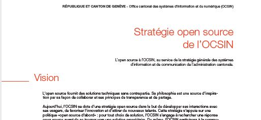
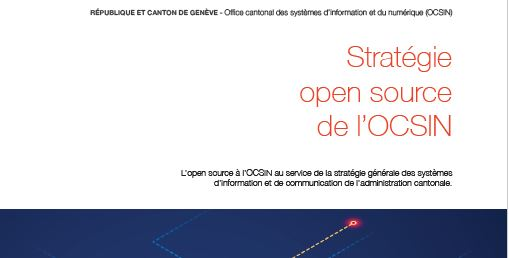
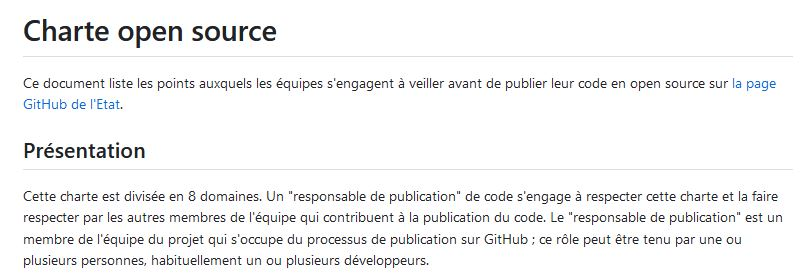

# Stratégie open source

L'Office cantonal des systèmes informatiques et du numérique (OCSIN),
responsable des services informatique de l'État de Genève,
a établi une stratégie de promotion de l'open source en son sein.

## Stratégie : résumé

## Stratégie : document complet

## Charte de publication

